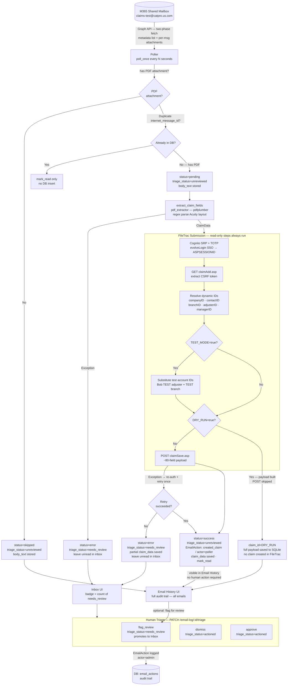

# Email Processing Workflow

End-to-end flow for every email the poller touches — from M365 inbox to FileTrac claim and human triage.

## Key design decisions

**Triage states**

| `triage_status` | Set by | Meaning |
|---|---|---|
| `unreviewed` | Poller (all outcomes) | Default — not yet examined by a human |
| `needs_review` | Poller (errors) or human `flag_review` | In the Inbox action queue |
| `actioned` | Human `dismiss` or `approve` | Resolved; distinction captured in `email_actions` |

- **The happy path is fully automated** — if the PDF parses cleanly and the FileTrac submission succeeds, the claim is created with no human intervention. The email is marked read and the record sits in Email History at `unreviewed`. No action required.
- **Errors land in the Inbox automatically** (`needs_review`) — no human action needed to surface them. A human must resolve them.
- **Successes stay at `unreviewed`** — visible in Email History but not in the Inbox. A human can optionally `flag_review` → `approve`/`dismiss`, but it is not required for the claim to exist in FileTrac.
- **`approve` and `dismiss` both set `actioned`** — the difference is recorded in `email_actions.action_type`, not duplicated as a fourth triage state.

**Email paths**

- **Skipped** (no PDF): inserted once, never re-processed; visible in Email History only. `body_text` is stored so a future classification agent can act on it.
- **Duplicate**: `mark_read` and move on — no second DB row.
- **Extraction failure**: `status=error`, left unread in the shared mailbox for manual review.
- **Submission failure**: `status=error`, partial `claim_data` saved, left unread. Re-auth + single retry before giving up.

**Config modes** (combinable)

| | `DRY_RUN=false` | `DRY_RUN=true` |
|---|---|---|
| `TEST_MODE=false` | Production: real IDs, claim created | Preview: real IDs, payload saved, no POST |
| `TEST_MODE=true` | Test claim: Bob TEST adjuster + TEST branch | Dev: test IDs, payload saved, no POST |

`DRY_RUN` gates only the final `POST claimSave.asp`. All prior steps — auth, CSRF fetch, ID resolution — run in both modes. The fully-built payload is saved to SQLite so you can inspect exactly what would have been sent.

## Related files

- [`backend/app/services/poller.py`](../backend/app/services/poller.py) — `poll_once`, all DB helpers
- [`backend/app/services/email_source.py`](../backend/app/services/email_source.py) — `GraphMailSource`, two-phase fetch, `@odata.nextLink` pagination
- [`backend/app/services/pdf_extractor.py`](../backend/app/services/pdf_extractor.py) — `extract_claim_fields`, Acuity PDF parsing
- [`backend/app/services/filetrac_submit.py`](../backend/app/services/filetrac_submit.py) — `submit_claim`, FileTrac ID resolution, DRY_RUN gate
- [`backend/app/models.py`](../backend/app/models.py) — `ProcessedEmail`, `ClaimData`, `EmailAction` ORM models
- [`backend/app/routes.py`](../backend/app/routes.py) — triage endpoints (`/inbox`, `/email-log`, `/email-log/:id/triage`)
