# FastAPI + React Claims Dashboard

## Enhancement Summary

**Deepened on:** 2026-04-02
**Research agents used:** framework-docs-researcher, best-practices-researcher, architecture-strategist, performance-oracle, security-sentinel, data-integrity-guardian, kieran-python-reviewer, kieran-typescript-reviewer, code-simplicity-reviewer, julik-frontend-races-reviewer

### Critical Fixes (blocks correctness)

1. **SQLAlchemy engine must set `check_same_thread=False` and `PRAGMA busy_timeout=5000`** — without these, API crashes on multi-thread access or gets intermittent SQLITE_BUSY errors
2. **Import paths wrong** — scripts should use `from app.services...` not `from backend.app.services...` when running from `backend/`
3. **Route registration order** — `/claims/stats` must register before `/claims/{id}` or FastAPI captures "stats" as an `{id}` parameter
4. **`joinedload` insufficient for search** — must use explicit `join(ClaimData)` + `contains_eager()` when filtering on ClaimData columns
5. **Alembic `stamp head` alone is insufficient** — need actual migration for `dry_run` column + backfill (`WHERE claim_id = 'DRY_RUN'`)
6. **Date columns must use `String` not `DateTime`** — existing ISO 8601 with timezone suffix (`+00:00`) breaks SQLAlchemy's DateTime adapter; parse in Pydantic schemas instead
7. **`async def get_db()` dependency** — avoids the sync dependency thread pool deadlock (FastAPI issue #3205)

### High-Value Improvements

1. **Return stats inline with claims list response** — eliminates stats/table consistency race condition, reduces to 3 endpoints
2. **Actually split `process_claim.py`** into `eml_parser.py`, `pdf_extractor.py`, `filetrac_auth.py`, `filetrac_submit.py` during migration
3. **Use `useSearchParams` from React Router for filter state** — drop Zustand for filters; URL is the single source of truth
4. **Differentiate `refetchInterval` per hook** — 30s for list, none for detail (immutable after processing), 5min for trends
5. **Add Zod schemas at the API fetch boundary** — runtime validation of responses, derive TS types from Zod
6. **Security: explicit `127.0.0.1` binding, `SecretStr` for credentials, specific CORS origins**
7. **Redact `filetrac_csrf_token` and sensitive payload fields** from API responses
8. **Drawer must mount at AppLayout level**, independent of table query state — prevents re-render/remount on list refetch
9. **Debounce search input (300ms)** with `AbortController` to cancel in-flight requests
10. **Add `UNIQUE` constraint on `claim_data.email_id`** to enforce the 1:1 relationship the ERD declares
11. **Poller heartbeat**: health check should examine recent error rate, not just recency — a failing poller still updates `processed_at`

### Simplification Decisions

After simplicity review, these changes reduce scope without sacrificing the user experience:

- **Cut `/api/v1/claims/stats` as a separate endpoint** — return stats inline with the claims list response
- **Defer trend chart to v1.1** — the summary cards + table provide 95% of the value; cuts Recharts dependency
- **Flatten backend directories** — `models.py` and `schemas.py` as flat files, not directories with `__init__.py`
- **Keep Alembic** (despite simplicity reviewer's objection) — needed for the planned SQLite→Postgres migration path; `render_as_batch=True` for SQLite compatibility
- **Keep sidebar** (user explicitly requested it) — but only 2 active nav items for v1 (Dashboard, Claims)
- **Keep service layer migration** (user explicitly chose option A in brainstorm) — but actually decompose the monolith

## Overview

Build a monorepo FastAPI + React application for CatPro claim automation. Consolidate the existing `catpro/` pipeline into the FastAPI backend as a service layer. The React frontend provides a Cursor-styled dark dashboard with summary stats, trend charts, and a claims table with detail drawer. (see brainstorm: docs/brainstorms/2026-04-01-fastapi-react-dashboard-brainstorm.md)

## Problem Statement / Motivation

Processed claims currently live in a SQLite database with no visibility. The only way to check claim status is to query the database directly or read logs. CatPro needs a dashboard to monitor claim processing in real-time, troubleshoot failures, and understand volume trends — especially during CAT events.

## Proposed Solution

A monorepo with `backend/` (FastAPI + SQLAlchemy) and `frontend/` (React + Vite + Tailwind). The existing `catpro/` package is consolidated into `backend/app/services/`. Scripts (CLI, poller, test email) import from the service layer. The frontend mirrors the ai-reporting project's Cursor-styled dark theme.

## Key Design Decisions

(Carried forward from brainstorm)

- **catpro/ → backend/app/services/**: single codebase, single Docker image
- **Sync SQLAlchemy 2.0 with `def` routes**: FastAPI auto-runs sync handlers in a thread pool. Simple, adequate for internal tool. No async/aiosqlite complexity.
- **Alembic migrations**: fresh ORM models, `alembic stamp head` on existing databases
- **No auth v1**: internal tool, bind to localhost or VPN only
- **Poller stays separate process**: Celery eventually
- **Offset-based pagination**: with `total_count`, suitable for low volume (<10k rows)
- **URL-driven filters**: Zustand store synced with URL search params
- **Auto-refresh**: React Query `refetchInterval: 30000` with "last updated" indicator

## Design Decisions from SpecFlow Analysis

- **Store partial claim_data on errors**: modify poller to extract and save fields before submission attempt. Critical for troubleshooting.
- **Add `dry_run` boolean column** to `processed_emails`: distinct from success status. Exclude from success rate stats unless explicitly included.
- **Stats endpoint respects filters**: accept same filter params as claims list for consistency.
- **Trends endpoint**: last 30 days default, daily granularity, zero-filled, configurable `from`/`to` params.
- **Health endpoint**: `GET /api/health` checks most recent `processed_at`. Warning if older than 2x poll interval.
- **Text search**: `LIKE '%term%'` across subject, insured name, policy number. Fine for expected volume.
- **API versioned at `/api/v1/`**: low cost now, avoids pain later.
- **Collapsible JSON viewer** for submission payload in detail drawer.

## Technical Approach

### ERD

```mermaid
erDiagram
    processed_emails {
        int id PK
        string message_id
        string internet_message_id UK
        string subject
        string sender
        datetime received_at
        datetime processed_at
        string claim_id
        string status
        string error_message
        boolean dry_run
    }
    claim_data {
        int id PK
        int email_id FK
        string insured_first_name
        string insured_last_name
        string insured_email
        string insured_phone
        string insured_cell
        string insured_address1
        string insured_city
        string insured_state
        string insured_zip
        string secondary_insured_first
        string secondary_insured_last
        string loss_date
        string loss_type
        string loss_description
        string loss_address1
        string loss_city
        string loss_state
        string loss_zip
        string policy_number
        string policy_effective
        string policy_expiration
        string client_company_name
        string client_claim_number
        string agent_company
        string agent_phone
        string agent_email
        string agent_address1
        string agent_city
        string agent_state
        string agent_zip
        string assigned_adjuster_name
        string filetrac_company_id
        string filetrac_contact_id
        string filetrac_branch_id
        string filetrac_adjuster_id
        string filetrac_manager_id
        string filetrac_csrf_token
        text submission_payload
        datetime created_at
    }
    processed_emails ||--o| claim_data : "has"
```



### API Endpoints

> **Changed from original plan**: Stats merged into claims list response (eliminates consistency race condition). Trends deferred to v1.1. Health endpoint added.

| Endpoint | Method | Description | Query Params |
|----------|--------|-------------|--------------|
| `/api/v1/claims` | GET | Paginated list + inline stats | `page`, `page_size`, `status`, `from`, `to`, `search`, `sort_by`, `sort_order` |
| `/api/v1/claims/{id}` | GET | Full detail (joined) | — |
| `/api/v1/health` | GET | System health + poller status | — |

> **Route registration order**: `/claims/{id}` uses `{id: int}` path type to avoid capturing "health" or future sub-paths as an ID.

### API Response Schemas

```python
from datetime import datetime, date
from pydantic import BaseModel, ConfigDict

# GET /api/v1/claims
class ClaimListResponse(BaseModel):
    items: list[ClaimSummary]
    total: int
    page: int
    page_size: int
    stats: ClaimStats              # inline stats — same query, same transaction
    last_processed_at: str | None  # most recent processed_at — frontend derives staleness

class ClaimSummary(BaseModel):
    model_config = ConfigDict(from_attributes=True)

    id: int
    subject: str | None
    sender: str | None
    received_at: datetime | None   # parsed from ISO 8601 in Pydantic validator
    processed_at: datetime
    claim_id: str | None
    status: str                    # "pending" | "success" | "error"
    dry_run: bool
    insured_name: str | None       # derived: "Last, First"
    error_message: str | None

# GET /api/v1/claims/{id}
class ClaimDetail(ClaimSummary):
    claim_data: ClaimDataSchema | None
    resolved_ids: dict[str, str | None] | None  # CSRF token redacted
    submission_payload: dict | None              # sensitive fields redacted

# Inline in ClaimListResponse
class ClaimStats(BaseModel):
    total: int
    success: int
    error: int
    pending: int
    dry_run: int
    success_rate: float | None  # None when success + error == 0 (division-by-zero guard)

# Error responses
class ErrorResponse(BaseModel):
    detail: str

# GET /api/v1/health
class HealthResponse(BaseModel):
    status: str              # "ok" | "degraded" | "unknown"
    last_processed_at: str | None
    recent_error_rate: float | None  # errors / total in last hour
    poll_interval: int
```

#### Research Insights: API Design

**Security — field redaction** (from security review):
- Strip `filetrac_csrf_token` from `resolved_ids` before returning
- Redact `pageLayout_CSRtoken`, `insuredSSN`, `insuredDriversLicense`, `insuredDOB` from `submission_payload`
- Do this at the API layer, not in the database — stored values retain forensic utility

**Performance — query pattern** (from performance review):
- Use explicit `outerjoin(ClaimData)` + `contains_eager()` when search is active — not `joinedload` which generates redundant joins
- Build count query *without* the ClaimData join when search is not active
- Escape LIKE wildcards in search: `search.replace("%", r"\%").replace("_", r"\_")`

**Race conditions — stats consistency** (from frontend races review):
- Inline stats in the list response guarantees stats and table are from the same DB transaction
- This was the primary motivation for merging the stats endpoint

## UI Mockups

### App Shell (Sidebar + Top Bar + Content)

```
+------------------+---------------------------------------------------+
| CatPro Claims    | Dashboard                  * Poller OK  Updated 5s|
| <<               +---------------------------------------------------+
|                  |                                                     |
|  * Dashboard     |  (page content area — see below)                   |
|  * Claims        |                                                     |
|                  |                                                     |
|  SETTINGS  >     |                                                     |
|    Adjusters     |                                                     |
|    Poller Config |                                                     |
|                  |                                                     |
|                  |                                                     |
|                  |                                                     |
|  * System Health |                                                     |
+------------------+---------------------------------------------------+
```

- Sidebar: collapsible (`<<` toggles to icon-only mode), dark bg (`#121212`)
- Active nav item highlighted with green accent (`#22c55e`) left border
- Top bar: page title on left, poller status + last updated on right
- Sidebar width: 224px expanded, 56px collapsed (matches ai-reporting)

### Sidebar Collapsed

```
+----+--------------------------------------------------------------+
| CP | Dashboard                           * Poller OK   Updated 5s |
|    +--------------------------------------------------------------+
| *  |                                                               |
| *  |  (page content area)                                          |
|    |                                                               |
| *  |                                                               |
| *  |                                                               |
|    |                                                               |
|    |                                                               |
| *  |                                                               |
+----+--------------------------------------------------------------+
```

### Dashboard Page Content

```
+---------------------------------------------------------------+
|                                                                 |
| +------------+ +------------+ +------------+ +------------+    |
| | TOTAL       | | SUCCESS    | | ERRORS     | | PENDING    |    |
| | CLAIMS      | | RATE       | |            | |            |    |
| |    142      | |   94.2%    | |     8      | |     3      |    |
| | +12 today   | |  ^2.1%    | |  v3 today  | |            |    |
| +------------+ +------------+ +------------+ +------------+    |
|                                                                 |
| +-----------------------------------------------------------+  |
| | Daily Claims Volume                        Last 30 days   |  |
| |                                                            |  |
| |   12 |          **                                         |  |
| |   10 |    *    *  *        *                               |  |
| |    8 |   * *  *    *      * *          *                   |  |
| |    6 |  *   **      **   *   *   *    * *    *             |  |
| |    4 | *              * *     * * *  *   *  * *             |  |
| |    2 |*                *       *   **     **   **           |  |
| |    0 +---------------------------------------------------  |  |
| |      Mar 2                   Mar 16               Apr 1    |  |
| |      ---- Success  ---- Errors                             |  |
| +-----------------------------------------------------------+  |
|                                                                 |
| +-----------------------------------------------------------+  |
| | [Last 30 days v]  [All Status v]  [Search claims...]      |  |
| +-----------------------------------------------------------+  |
|                                                                 |
| +-----------------------------------------------------------+  |
| | Date       | Subject       | Insured      | Status | ID   |  |
| |------------|---------------|--------------|--------|------|  |
| | 04/01 9:32 | Fw: TG4832   | Smith, John  | [OK]   | 1847 |  |
| | 04/01 9:15 | Fw: TG4831   | Jones, Mary  | [OK]   | 1846 |  |
| | 04/01 8:58 | Fw: TG4830   | Davis, Rob   | [ERR]  |  --  |  |
| | 03/31 4:12 | Fw: TG4829   | Lee, Sarah   | [DRY]  | DRY  |  |
| | 03/31 3:45 | Fw: TG4828   | Brown, Mike  | [OK]   | 1845 |  |
| | ...        |               |              |        |      |  |
| +-----------------------------------------------------------+  |
| |                  < 1  2  3  4  5 >   Showing 1-25 of 142  |  |
| +-----------------------------------------------------------+  |
|                                                                 |
+---------------------------------------------------------------+
```

### Status Badges

```
[OK]  = green bg  (#22c55e), white text  — "Success"
[ERR] = red bg    (#dc2626), white text  — "Error"
[...] = amber bg  (#f59e0b), white text  — "Pending"
[DRY] = blue bg   (#3b82f6), white text  — "Dry Run"
```

### Claim Detail Drawer (slides in from right, pushes content)

```
+------------------+-------------------------------+--------------------+
| CatPro Claims    | Dashboard (compressed)        | Claim Detail  [X]  |
| <<               +-------------------------------+--------------------|
|                  |                               | Status: [OK]       |
|  * Dashboard     |  (dashboard content           | Claim ID: 1847234  |
|  * Claims        |   shifts left to              | Processed: 04/01   |
|                  |   accommodate drawer)         | Received:  04/01   |
|  SETTINGS  >     |                               |                    |
|    Adjusters     |                               | -- Insured --------|
|    Poller Config |                               | Name: John Smith   |
|                  |                               | Phone: 555-123-4567|
|                  |                               | Email: j@smith.com |
|                  |                               | Addr: 123 Oak St   |
|  * System Health |                               |       Madison, WI  |
|                  |                               |                    |
|                  |                               | -- Loss Info ------|
|                  |                               | Date: 03/28/2026   |
|                  |                               | Type: Wind/Hail    |
|                  |                               | Desc: Roof damage  |
|                  |                               |   from severe storm|
|                  |                               | Addr: 123 Oak St   |
|                  |                               |                    |
|                  |                               | -- Policy ---------|
|                  |                               | #: HO-1234567      |
|                  |                               | Eff: 01/01/2026    |
|                  |                               | Exp: 01/01/2027    |
|                  |                               |                    |
|                  |                               | -- FileTrac IDs ---|
|                  |                               | Company: 48291     |
|                  |                               | Contact: 58123     |
|                  |                               | Branch:  12        |
|                  |                               | Adjuster: 319972   |
|                  |                               | Manager:  319972   |
|                  |                               |                    |
|                  |                               | v Submission Payload|
|                  |                               | (collapsed JSON)   |
+------------------+-------------------------------+--------------------+
```

### Error Claim Detail Drawer

```
                                                   +--------------------+
                                                   | Claim Detail  [X]  |
                                                   |--------------------|
                                                   | Status: [ERR]      |
                                                   | Claim ID: --       |
                                                   | Processed: 04/01   |
                                                   |                    |
                                                   | !! Error Message --|
                                                   | HTTPError: 403     |
                                                   | Forbidden -        |
                                                   | FileTrac session   |
                                                   | expired during     |
                                                   | submission         |
                                                   |                    |
                                                   | -- Partial Data ---|
                                                   | (extracted before  |
                                                   |  failure)          |
                                                   | Name: Rob Davis    |
                                                   | Policy: HO-9876543|
                                                   | Loss: 03/27/2026  |
                                                   | ...                |
                                                   +--------------------+
```

### Health Warning Banner (when poller is stale)

```
+------------------+---------------------------------------------------+
| CatPro Claims    | [!] Poller has not run in 5 min. Claims may be    |
| <<               |     stale.                                [Dismiss]|
|                  +---------------------------------------------------+
|  * Dashboard     | Dashboard                  ! Poller STALE         |
|  * Claims        +---------------------------------------------------+
|                  | (rest of dashboard content)                        |
|  ...             |                                                    |
+------------------+---------------------------------------------------+
```

### Empty State (fresh install)

```
+------------------+---------------------------------------------------+
| CatPro Claims    | Dashboard                                         |
| <<               +---------------------------------------------------+
|                  |                                                     |
|  * Dashboard     | +------------+ +------------+ +--------+ +------+ |
|  * Claims        | | TOTAL: 0   | | RATE: --   | | ERR: 0 | | P: 0 | |
|                  | +------------+ +------------+ +--------+ +------+ |
|  SETTINGS  >     |                                                    |
|    Adjusters     |        +-------------------------------+           |
|    Poller Config |        |                               |           |
|                  |        |  No claims processed yet.     |           |
|                  |        |                               |           |
|                  |        |  Start the poller to begin    |           |
|  * System Health |        |  processing claim emails.     |           |
|                  |        |                               |           |
|                  |        |  python3.13 -m scripts.poll   |           |
|                  |        |                               |           |
|                  |        +-------------------------------+           |
|                  |                                                     |
+------------------+---------------------------------------------------+
```

## Implementation Phases

### Phase 1: Backend Foundation

Set up the FastAPI project structure, SQLAlchemy models, Alembic, and config.

**Files to create:**

- `backend/app/__init__.py`
- `backend/app/main.py` — FastAPI app with CORS, lifespan, router mount at `/api/v1`
- `backend/app/config.py` — Pydantic Settings evolved from `catpro/config.py`, add `@lru_cache`, add `cors_origins`, `host: str = "127.0.0.1"`
- `backend/app/database.py` — `create_engine` (sync), `SessionLocal` factory, `get_db` dependency
- `backend/app/models.py` — `ProcessedEmail` + `ClaimData` ORM models (flat file, not directory)
- `backend/app/schemas.py` — all Pydantic response schemas (flat file, not directory)
- `backend/app/routes.py` — route stubs (implement in Phase 3)
- `backend/alembic/` — `alembic init` with `render_as_batch=True` for SQLite compatibility
- `backend/alembic.ini`
- `backend/requirements.txt` — fastapi, uvicorn[standard], sqlalchemy, alembic, pydantic-settings, plus all existing catpro deps
- `backend/pyproject.toml` — package config with console_script entry points

#### Research Insights: Backend Configuration

**SQLAlchemy engine (CRITICAL — from framework-docs and performance reviews):**

```python
from sqlalchemy import create_engine, event

engine = create_engine(
    f"sqlite:///{settings.db_path}",
    connect_args={"check_same_thread": False},  # REQUIRED for multi-thread access
    pool_pre_ping=True,
)

@event.listens_for(engine, "connect")
def set_sqlite_pragma(dbapi_conn, connection_record):
    cursor = dbapi_conn.cursor()
    cursor.execute("PRAGMA journal_mode=WAL")
    cursor.execute("PRAGMA busy_timeout=5000")  # retry for 5s on SQLITE_BUSY
    cursor.execute("PRAGMA foreign_keys=ON")
    cursor.close()
```

**Database dependency (CRITICAL — avoids thread pool deadlock, FastAPI #3205):**

```python
# Use async def to run on event loop, not thread pool
async def get_db():
    with Session(engine) as session:
        yield session
```

**ORM models — use `String` not `DateTime` for date columns:**

Existing code writes ISO 8601 with timezone (`2026-04-01T09:32:15+00:00`). SQLAlchemy's `DateTime` adapter expects `YYYY-MM-DD HH:MM:SS`. Use `Mapped[str]` in models, parse to `datetime` in Pydantic response schemas with a `@field_validator`.

**Pydantic Settings — security (from security review):**

```python
from pydantic import SecretStr

class Settings(BaseSettings):
    filetrac_password: SecretStr   # prevents accidental serialization
    filetrac_totp_secret: SecretStr
    azure_client_secret: SecretStr
    host: str = "127.0.0.1"       # NEVER default to 0.0.0.0
    cors_origins: list[str] = ["http://localhost:5173"]
    # ...
```

**CORS — explicit and restrictive (from security review):**

```python
app.add_middleware(
    CORSMiddleware,
    allow_origins=settings.cors_origins,  # ["http://localhost:5173"] only
    allow_credentials=False,
    allow_methods=["GET"],                # read-only dashboard
    allow_headers=["*"],
)
```

**Alembic — SQLite batch mode and FK safety:**

```python
# In alembic/env.py
def run_migrations_online():
    with connectable.connect() as connection:
        connection.execute(text("PRAGMA foreign_keys=OFF"))
        context.configure(
            connection=connection,
            target_metadata=target_metadata,
            render_as_batch=True,  # CRITICAL for SQLite ALTER TABLE
        )
        with context.begin_transaction():
            context.run_migrations()
        connection.execute(text("PRAGMA foreign_keys=ON"))
```

**Initial Alembic migration must:**
1. Define ORM models matching existing schema exactly
2. Generate initial migration: `alembic revision --autogenerate -m "initial schema"`
3. Add second migration for `dry_run` column: `ALTER TABLE processed_emails ADD COLUMN dry_run BOOLEAN NOT NULL DEFAULT 0`
4. Backfill: `UPDATE processed_emails SET dry_run = 1 WHERE claim_id = 'DRY_RUN'`
5. Add `UNIQUE` constraint on `claim_data.email_id`
6. For existing databases: `alembic stamp <base_revision>` then `alembic upgrade head`
7. For fresh databases: `alembic upgrade head`

**Indexes to add in migration:**
- `processed_emails(status)` — used in stats filtering
- `processed_emails(processed_at)` — used in date range filtering and ORDER BY
- `claim_data(email_id)` — used in JOIN (SQLite does not auto-index FKs)

**Verification:** `cd backend && python3.13 -c "from app.main import app; print(app.title)"`

### Phase 2: Service Layer Migration

Move `catpro/` modules into `backend/app/services/`. **Actually decompose** `process_claim.py` (939 lines) into logical modules — the existing code has clear phase headers marking the seams. Keep original `catpro/` until poller processes a real email through the new paths.

**Files to create:**

- `backend/app/services/__init__.py`
- `backend/app/services/eml_parser.py` — `parse_eml()` and MIME walking logic (from `process_claim.py` Phase 1)
- `backend/app/services/pdf_extractor.py` — `extract_claim_fields()` and all Acuity PDF regex (from `process_claim.py` Phase 2). Largest module, most likely to grow when adding other insurers
- `backend/app/services/filetrac_auth.py` — `build_session()`, `login()`, Cognito SRP, TOTP handling, `evolveLogin` SSO
- `backend/app/services/filetrac_submit.py` — `submit_claim()`, CSRF extraction, dynamic ID resolution, payload building. Accept `dry_run: bool` as explicit parameter (not read from env/settings)
- `backend/app/services/claim_processor.py` — thin orchestration facade that composes the above four modules
- `backend/app/services/email_source.py` — from `catpro/email_source.py`
- `backend/app/services/poller.py` — from `catpro/poller.py`, update imports, store partial claim_data on errors, port to SQLAlchemy sessions
- `backend/app/services/test_email.py` — from `catpro/test_email.py`
- `backend/data/adjusters.json` — moved out of services package (data files alongside Python modules create packaging headaches)

**Script entry points (import fix — from architecture review):**

```python
# Run from backend/ directory. Imports are from app.*, NOT backend.app.*
# backend/scripts/process_claim.py
from app.services.claim_processor import parse_and_submit
# backend/scripts/poll.py
from app.services.poller import Poller
```

**Critical: Preserve these patterns:**
- TOTP window-boundary guard (wait if <5s remaining)
- Single session reuse across poll cycle
- `internet_message_id` UNIQUE constraint
- Crash safety: **`session.commit()` immediately after inserting pending row** — this is the duplicate-claim prevention mechanism. Do NOT defer to end-of-request.
- Combine `mark_success` + `insert_claim_data` into a single transaction (prevents orphaned success rows)

**Three-tier error handling for partial claim_data (from data integrity review):**
1. **Extraction fails**: save raw error message only (no ClaimData to store)
2. **Extraction succeeds, submission fails**: save full `claim_fields` dict + error message
3. **Extraction succeeds, submission succeeds**: save everything (existing happy path)

**Verification:**
1. CLI: `cd backend && python3.13 -m scripts.process_claim ../data/templates/sample_acuity_claim.eml`
2. Poller: `cd backend && python3.13 -m scripts.poll` — must process at least one real email before removing `catpro/`

### Phase 3: API Routes

Implement 3 endpoints with SQLAlchemy queries.

**Files to modify:**

- `backend/app/routes.py` — full implementation:
  - `GET /claims` — paginated list + inline stats (same transaction)
  - `GET /claims/{id:int}` — single row with full claim_data join, redacted payload
  - `GET /health` — check latest `processed_at` + recent error rate

**Corrected query pattern (from performance + architecture reviews):**

```python
from sqlalchemy.orm import contains_eager, joinedload

def list_claims(session, filters, page, page_size):
    base = select(ProcessedEmail)

    # Apply filters on ProcessedEmail only (no join needed)
    if filters.status:
        base = base.where(ProcessedEmail.status == filters.status)
    if filters.from_date:
        base = base.where(ProcessedEmail.processed_at >= filters.from_date)

    # Search requires explicit JOIN (not joinedload!) to filter on ClaimData
    if filters.search:
        escaped = filters.search.replace("%", r"\%").replace("_", r"\_")
        base = base.outerjoin(ClaimData).options(
            contains_eager(ProcessedEmail.claim_data)
        ).where(
            or_(
                ProcessedEmail.subject.ilike(f"%{escaped}%", escape="\\"),
                ClaimData.insured_first_name.ilike(f"%{escaped}%", escape="\\"),
                ClaimData.insured_last_name.ilike(f"%{escaped}%", escape="\\"),
                ClaimData.policy_number.ilike(f"%{escaped}%", escape="\\"),
            )
        )
    else:
        # No search — use joinedload (separate SELECT, no redundant join in count)
        base = base.options(joinedload(ProcessedEmail.claim_data))

    # Count query — skip ClaimData join when search is not active
    total = session.scalar(select(func.count()).select_from(base.subquery()))

    # Data query with pagination
    items = session.scalars(
        base.order_by(ProcessedEmail.processed_at.desc())
        .offset((page - 1) * page_size)
        .limit(page_size)
    ).unique().all()

    # Stats — same session, same transaction, guaranteed consistent
    stats = compute_stats(session, filters)

    return ClaimListResponse(items=items, total=total, page=page,
                            page_size=page_size, stats=stats,
                            last_processed_at=get_last_processed(session))
```

**Field redaction in detail endpoint (from security review):**

```python
REDACTED_PAYLOAD_KEYS = {"pageLayout_CSRtoken", "insuredSSN",
                          "insuredDriversLicense", "insuredDOB"}
REDACTED_RESOLVED_KEYS = {"csrf_token"}

def redact_payload(payload: dict | None) -> dict | None:
    if not payload:
        return payload
    return {k: "[REDACTED]" if k in REDACTED_PAYLOAD_KEYS else v
            for k, v in payload.items()}
```

**Health endpoint — check error rate, not just recency (from races review):**

```python
@router.get("/health")
def health_check(session: SessionDep, settings: SettingsDep):
    last = session.scalar(
        select(func.max(ProcessedEmail.processed_at))
    )
    # Check error rate in last hour
    hour_ago = (datetime.now(timezone.utc) - timedelta(hours=1)).isoformat()
    recent_total = session.scalar(
        select(func.count()).where(ProcessedEmail.processed_at >= hour_ago)
    )
    recent_errors = session.scalar(
        select(func.count()).where(
            ProcessedEmail.processed_at >= hour_ago,
            ProcessedEmail.status == "error"
        )
    )
    error_rate = recent_errors / recent_total if recent_total else None
    stale_threshold = settings.poll_interval_seconds * 2
    # ... determine status from last_processed_at age and error_rate
```

**Verification:** `cd backend && uvicorn app.main:app --reload` then `curl localhost:8000/api/v1/claims`

### Phase 4: Frontend Foundation

Scaffold the React app with Vite, Tailwind dark theme, layout, and routing. Can start in parallel with Phase 3 (no backend dependency).

**Files to create:**

- `frontend/package.json` — React 19, TypeScript, Vite, Tailwind, React Query, Zod, Lucide, Axios, date-fns, clsx, tailwind-merge (no Zustand, no Recharts for v1)
- `frontend/vite.config.ts` — React plugin, `@/` alias, port 5173, proxy `/api` to FastAPI
- `frontend/tailwind.config.js` — HSL CSS variable mapping (exact colors from ai-reporting)
- `frontend/postcss.config.js` — tailwindcss + autoprefixer
- `frontend/tsconfig.json`, `frontend/tsconfig.app.json`, `frontend/tsconfig.node.json`
- `frontend/index.html` — include dark mode FOUC prevention script in `<head>`
- `frontend/src/main.tsx` — QueryClientProvider + RouterProvider + ErrorBoundary
- `frontend/src/router.tsx` — `createBrowserRouter` with AppLayout shell and route children
- `frontend/src/index.css` — Tailwind directives + dark theme CSS variables (same as before)
- `frontend/src/lib/utils.ts` — `cn()` (clsx + twMerge)
- `frontend/src/lib/api.ts` — Axios instance with base URL, `AbortController` support for request cancellation
- `frontend/src/lib/queryClient.ts` — staleTime 30s, gcTime 5min, retry 1, refetchOnWindowFocus true (with staleness indicator)
- `frontend/src/schemas/claim.ts` — **Zod schemas** for API response validation, TypeScript types inferred from Zod
- `frontend/src/components/layout/AppLayout.tsx` — Sidebar + TopBar + `<Outlet/>` + ClaimDetail drawer (mounted at layout level, not inside Dashboard)
- `frontend/src/components/layout/Sidebar.tsx` — collapsible (224px / 56px), nav items with active green accent border, v1: Dashboard + Claims active, Settings section placeholder
- `frontend/src/components/layout/TopBar.tsx` — page title, poller status dot (green/amber), "Updated Xs ago" badge (turns amber after 2 min stale)
- `frontend/src/pages/Dashboard.tsx` — placeholder layout: stats → table
- `frontend/src/components/ErrorBoundary.tsx`

#### Research Insights: Frontend Architecture

**Zod at the API boundary (from TypeScript review):**

```typescript
// schemas/claim.ts — single source of truth for types
import { z } from "zod";

export const ClaimSummarySchema = z.object({
  id: z.number(),
  subject: z.string().nullable(),
  status: z.enum(["success", "error", "pending"]),
  dry_run: z.boolean(),
  insured_name: z.string().nullable(),
  // ...
});
export type ClaimSummary = z.infer<typeof ClaimSummarySchema>;

// In hooks — runtime validation catches backend schema drift
queryFn: async () => {
  const { data } = await apiClient.get("/claims", { params });
  return ClaimListResponseSchema.parse(data);
}
```

**FOUC prevention (from best-practices research):**

```html
<!-- index.html <head> — prevents white flash -->
<script>document.documentElement.classList.add("dark");</script>
```

**Dark mode note:** Since this is a Cursor-styled dashboard that is always dark, skip the theme toggle for v1. Just set `.dark` class permanently.

**Verification:** `cd frontend && npm install && npm run dev` — dark themed page loads at localhost:5173

### Phase 5: Frontend Features

Build the dashboard components, data fetching, filtering, and detail drawer.

**Files to create:**

- `frontend/src/hooks/useClaimFilters.ts` — thin wrapper around `useSearchParams` (React Router) — URL is source of truth, no Zustand
- `frontend/src/hooks/useClaims.ts` — React Query hooks (see intervals below)
- `frontend/src/hooks/useHealth.ts` — `GET /api/v1/health`, poll every 60s
- `frontend/src/components/dashboard/SummaryCards.tsx` — 4 cards: total, success rate, errors, pending. Loading skeletons. Data from inline stats in claims response.
- `frontend/src/components/claims/ClaimsTable.tsx` — sortable columns: date, subject, insured, status, claim ID. Status badges inline (no separate StatusBadge file). Click to open detail.
- `frontend/src/components/claims/ClaimDetail.tsx` — slide-over drawer (mounted in AppLayout). Full data, resolved IDs, collapsible JSON payload, error message with red highlight.
- `frontend/src/components/claims/FilterBar.tsx` — date range, status dropdown, debounced search input. Reads/writes `useSearchParams`.

#### Research Insights: React Query & State Management

**Filter state via `useSearchParams` (from TypeScript review — replaces Zustand):**

```typescript
// hooks/useClaimFilters.ts
import { useSearchParams } from "react-router";

export function useClaimFilters() {
  const [params, setParams] = useSearchParams();
  return {
    status: params.get("status"),
    from: params.get("from"),
    to: params.get("to"),
    search: params.get("search") ?? "",
    page: Number(params.get("page") ?? 1),
    setFilters: (updates: Record<string, string | null>) => {
      setParams(prev => {
        for (const [k, v] of Object.entries(updates)) {
          v ? prev.set(k, v) : prev.delete(k);
        }
        return prev;
      }, { replace: true }); // replace, don't push history
    },
  };
}
```

**Differentiated refetch intervals (from TypeScript + races reviews):**

```typescript
// hooks/useClaims.ts
export function useClaims(filters: ClaimFilters) {
  return useQuery({
    queryKey: ["claims", filters],  // object key — order-independent
    queryFn: ...,
    refetchInterval: 30_000,
    placeholderData: keepPreviousData,  // no flash between filter changes
  });
}

export function useClaimDetail(id: number | null) {
  return useQuery({
    queryKey: ["claims", id],
    queryFn: ...,
    enabled: !!id,               // don't fetch when no claim selected
    staleTime: Infinity,         // immutable after processing
    refetchInterval: (query) =>  // only poll pending claims
      query.state.data?.status === "pending" ? 10_000 : false,
  });
}
```

**Search debounce + request cancellation (from races review):**

```typescript
// In FilterBar.tsx
const [localSearch, setLocalSearch] = useState(filters.search);
const debouncedSearch = useDebouncedValue(localSearch, 300);

useEffect(() => {
  filters.setFilters({ search: debouncedSearch || null });
}, [debouncedSearch]);

// In useClaims queryFn — pass AbortController signal
queryFn: async ({ signal }) => {
  const { data } = await apiClient.get("/claims", { params, signal });
  return ClaimListResponseSchema.parse(data);
}
```

**Drawer race conditions (from races review — CRITICAL):**
- Drawer fetches its own data via `useClaimDetail(id)` — never derived from list response
- Drawer stays open when list refetches even if claim moves off current page
- Pause `refetchInterval` when user is interacting (scrolling payload, expanding JSON)
- Drawer mounted at AppLayout level — its lifecycle is independent of table re-renders

**Per-section error boundaries (from TypeScript review):**

```tsx
// Dashboard.tsx — each section handles errors independently
<ErrorBoundary fallback={<CardErrorState />}>
  <SummaryCards stats={data?.stats} isLoading={isLoading} />
</ErrorBoundary>
<ClaimsTable ... />  {/* table shows its own error/empty states inline */}
```

**Empty states to handle:**
- Fresh install (no data): "No claims processed yet. Start the poller to begin."
- No filter results: "No claims match your filters." with reset button
- Detail drawer error claim: show error message prominently, partial claim data if available

**Loading states:**
- Summary cards: pulse skeleton
- Table: skeleton rows
- Detail drawer: skeleton blocks

**Verification:** Full dashboard renders with mock data, filters work, detail drawer opens/closes

### Phase 6: Integration & Polish

Wire everything together, handle edge cases, add health monitoring.

**Files to modify/create:**

- `frontend/src/components/layout/TopBar.tsx` — health status indicator (green dot / amber warning), "Updated Xs ago" that turns amber after 2min
- Health warning banner inline in AppLayout (conditional render, not a separate component)
- Update `frontend/vite.config.ts` proxy to forward `/api` → `http://localhost:8000`
- `frontend/src/hooks/useHealth.ts` — `GET /api/v1/health`, poll every 60s, show warning banner if poller is stale or error rate > 50%
- Add `refetchIntervalInBackground: false` to all hooks — pause polling when tab is hidden (from security review)
- Test full flow: poller writes → API reads → frontend displays → auto-refresh picks up new data

**Docker prep (from best-practices research):**

```yaml
# docker-compose.dev.yml (future)
services:
  backend:
    command: uvicorn app.main:app --reload --host 127.0.0.1 --port 8000
    volumes:
      - ./backend/app:/app/app
      - ./data:/app/data  # shared SQLite — MUST be local filesystem, never NFS
  frontend:
    command: npm run dev -- --host 0.0.0.0
    ports:
      - "5173:5173"
```

**Verification:**
1. Start backend: `cd backend && uvicorn app.main:app --reload --port 8000`
2. Start frontend: `cd frontend && npm run dev`
3. Run test email: `cd backend && python3.13 -m scripts.send_test_email`
4. Start poller: `cd backend && python3.13 -m scripts.poll`
5. Watch dashboard auto-update as claims are processed
6. Verify health endpoint turns amber when poller is stopped

## Acceptance Criteria

### Functional

- [ ] FastAPI serves all 5 endpoints with correct response schemas
- [ ] SQLAlchemy models match existing SQLite schema + `dry_run` column
- [ ] Alembic migration runs cleanly on fresh database
- [ ] Service layer works for both API routes and CLI scripts
- [ ] Dashboard shows summary cards with real data
- [ ] Trend chart renders daily volume over last 30 days
- [ ] Claims table is paginated, sortable, and filterable
- [ ] Detail drawer shows full claim data with collapsible JSON payload
- [ ] Status badges distinguish success, error, pending, and dry_run
- [ ] Filters sync with URL params (bookmarkable)
- [ ] Auto-refresh every 30s with "last updated" indicator
- [ ] Health endpoint reports poller status
- [ ] Empty and loading states render appropriately
- [ ] Poller stores partial claim_data on errors

### Non-Functional

- [ ] Dark theme matches Cursor aesthetic (ai-reporting reference)
- [ ] API responses < 200ms for typical queries
- [ ] Frontend loads in < 2s
- [ ] No PII exposed without network-level access control (localhost binding)

## Dependencies & Risks

- **SQLite concurrent access**: WAL mode + `busy_timeout=5000` + `check_same_thread=False`. Safe for single-writer (poller) + multi-reader (FastAPI thread pool). Database file MUST be on local filesystem — never NFS/network mount. (Performance review)
- **Service migration**: moving catpro/ modules risks breaking imports. Phase 2 must be verified with existing CLI and poller workflows before removing `catpro/`. (Architecture review)
- **TOTP sensitivity**: single session reuse pattern must be preserved exactly. `commit()` after `insert_pending` is the duplicate-claim prevention mechanism. (Data integrity review)
- **Sync dependency deadlock (FastAPI #3205)**: use `async def get_db()` for the database dependency to avoid consuming thread pool slots. Low risk at this concurrency but costs nothing to prevent. (Framework docs research)
- **SQLite → Postgres gotchas**: `ilike()` (not `LIKE`) for case-insensitive search, `String` not `DateTime` for existing date columns, `JSON` not `JSONB` for portability, `render_as_batch=True` in Alembic. (Best practices research)
- **PII exposure**: No auth in v1, but API serves insured names, addresses, phone numbers, policy numbers. Explicit `127.0.0.1` binding and restricted CORS are the minimum controls. API key auth should be v1.1. (Security review)

## Open Questions (from brainstorm)

- ~~Alembic strategy~~ → fresh ORM models, stamp existing DBs
- ~~Script entry points~~ → pyproject.toml console scripts
- WebSocket for real-time updates → deferred to future, React Query polling sufficient for v1

## Sources & References

### Origin

- **Brainstorm document:** [docs/brainstorms/2026-04-01-fastapi-react-dashboard-brainstorm.md](docs/brainstorms/2026-04-01-fastapi-react-dashboard-brainstorm.md)
  - Key decisions: consolidate catpro into services, sync SQLAlchemy, Cursor dark theme, no auth v1, separate poller process

### Internal References

- Existing SQLite schema: `catpro/db.py:7-68`
- ClaimData model: `catpro/process_claim.py:82-119`
- SubmitResult: `catpro/process_claim.py:592-597`
- Poller architecture: `catpro/poller.py:22-133`
- Config pattern: `catpro/config.py:1-31`
- Reference frontend dark theme: `/Users/dirk.meilinger/Development/cursor-projects/ai-reporting/frontend/src/index.css:1-50`
- Reference Tailwind config: `/Users/dirk.meilinger/Development/cursor-projects/ai-reporting/frontend/tailwind.config.js:1-55`
- Reference DataTable: `/Users/dirk.meilinger/Development/cursor-projects/ai-reporting/frontend/src/components/common/DataTable.tsx`
- Reference SummaryCard: `/Users/dirk.meilinger/Development/cursor-projects/ai-reporting/frontend/src/components/dashboard/SummaryCard.tsx`
- Architecture Phase 3 plan: `docs/architecture.md:279-288`

### External References

- FastAPI docs: https://fastapi.tiangolo.com
- FastAPI sync dependency deadlock: https://github.com/fastapi/fastapi/issues/3205
- SQLAlchemy 2.0 docs: https://docs.sqlalchemy.org/en/20/
- SQLAlchemy SQLite dialect: https://docs.sqlalchemy.org/en/20/dialects/sqlite.html
- Alembic batch migrations (SQLite): https://alembic.sqlalchemy.org/en/latest/batch.html
- SQLite WAL mode: https://sqlite.org/wal.html
- TanStack React Query v5: https://tanstack.com/query/latest
- React Router v7: https://reactrouter.com
- Zod: https://zod.dev
- Tailwind CSS v4 theming: https://tailwindcss.com/docs/theme
- FastAPI best practices: https://github.com/zhanymkanov/fastapi-best-practices
