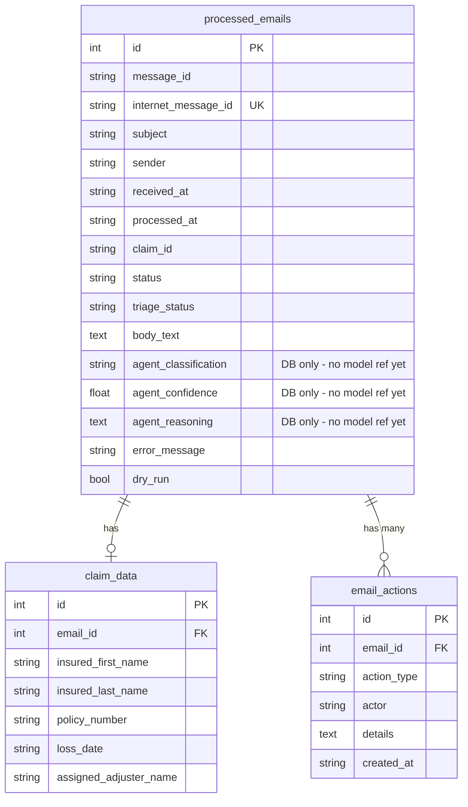

# feat: Mailbox Case Management — Inbox, Email History & Graph Pagination

## Enhancement Summary

**Deepened on:** 2026-04-05
**Research agents used:** Architecture Strategist, Data Integrity Guardian, Performance Oracle,
Security Sentinel, Kieran TypeScript Reviewer, Kieran Python Reviewer, Agent-Native Reviewer,
Code Simplicity Reviewer, Graph API Best Practices, UX Best Practices

### Key Corrections from Original Plan

1. **`success → triage_status='actioned'` is wrong.** Success cases should start `unreviewed`.
   Only an explicit human or agent approval action sets `actioned`. Poller logs a
   `created_claim` EmailAction, but the case stays open for human review.

2. **Cut `'archived'` triage state.** Both `dismiss` and `approve` map to `triage_status=
   'actioned'`. The distinction between dismissal and approval is captured in
   `email_actions.action_type` — a fourth state is redundant double-bookkeeping.

3. **Cut `actor` from `TriageActionRequest`.** No auth exists. Accepting `actor` from the
   client poisons the audit trail. Hardcode `"admin"` in the route; replace with auth token
   identity when auth arrives.

4. **Use `Literal["flag_review", "dismiss", "approve"]` for `action` in Pydantic.** Automatic
   422 validation; removes the manual `ACTION_TO_STATUS` guard entirely.

5. **Agent fields (`agent_classification`, `agent_confidence`, `agent_reasoning`) — add to
   Alembic migration only.** Do NOT add to the SQLAlchemy model or any Python/TypeScript
   schemas yet. No writer exists. Add model code when the agent ships.

6. **Remove `needs_review` from `EmailLogStats`.** It's already in `/inbox/count`. Two
   diverging sources of the same count on the same screen is a UX bug.

7. **Badge: call `useInboxCount()` in Sidebar directly.** Remove `badge: () => number |
   undefined` function-in-array pattern. Special-case the Inbox NavLink in JSX.

8. **Two-phase Graph fetch.** Do NOT use `$expand=attachments` on the message list. Fetch
   message metadata first, then fetch attachments separately only for messages that pass the
   PDF filter. Inline `contentBytes` at `$top=50` risks ~100MB+ responses.

9. **Use Graph delta query long-term.** `messages/delta?changeType=created` is the correct
   architecture for polling — returns only new arrivals since last poll. Plan this migration
   as a follow-up after initial ship.

10. **CRITICAL agent gap: email body not persisted.** The agent cannot classify a skipped
    email because `body_text` is discarded after the poller runs. Add `body_text TEXT` to
    `processed_emails` and store it at insert time for all email types.

11. **Inline row expand for Inbox (not modal).** Triage is a list-scanning workflow.
    Modals break context. UX research confirms inline expand is correct here.

12. **Optimistic removal with rollback** for Dismiss/Approve actions. Must use
    `cancelQueries` + snapshot pattern to handle concurrent dismissals correctly.

13. **`_compute_stats` → single GROUP BY query.** Six separate scalar queries must be
    replaced with one aggregation before adding more stat columns.

14. **`selectinload` for `email_actions` relationship** (one-to-many), not `joinedload`.

15. **CORS: add `POST`, `PATCH`, `DELETE`** — not just PATCH. Current GET+PUT is incomplete
    for existing routes too.

---

## Overview

Every email the poller touches becomes a **case** with a triage lifecycle. Humans are the
initial actors — they can flag, dismiss, or approve cases via an admin UI. When an AI agent
is added later, it slots into the same workflow without re-architecture. This builds the
full data model and two UI surfaces: a top-level **Inbox** (action queue) and an Admin
**Email History** (full audit trail). It also fixes the `$top=10` blind spot in the Graph
poller with proper pagination.

(see brainstorm: docs/brainstorms/2026-04-05-mailbox-case-management-brainstorm.md)

## Problem Statement

- The poller writes `processed_emails` rows with one of four statuses: `success`, `error`,
  `skipped`, `pending`. Errors and skipped emails have no human action surface.
- The Graph query uses `$top=10` with no pagination. Inboxes with >10 unread emails silently
  miss later messages — a correctness bug confirmed by code review.
- There is no audit trail of *who* took action on a case — essential for agent oversight.
- Email `body_text` is discarded after poller processing. The future agent cannot classify
  a skipped email with only subject and sender.

## Proposed Solution

Five workstreams delivered in sequence:

1. **Database schema** — add `triage_status` + `body_text` to `processed_emails`; add agent
   fields to the DB migration (not yet to Python model); create `email_actions` table.
2. **Graph pagination** — two-phase fetch (metadata then attachments), `@odata.nextLink` loop.
3. **Backend API** — new endpoints; single-query stats; `Literal` action validation.
4. **Frontend** — Inbox page with inline expand + optimistic updates; Email History; badge.
5. **Poller update** — store `body_text`; set correct `triage_status` on each outcome.

## Technical Approach

### Architecture

#### Triage Status Lifecycle (Corrected)

```
Poller inserts row
        │
        ├─► status=success  → triage_status='unreviewed'   ← CORRECTED: not 'actioned'
        │                      + EmailAction(action_type='created_claim', actor='poller')
        ├─► status=error    → triage_status='needs_review'
        ├─► status=skipped  → triage_status='unreviewed'
        └─► status=pending  → triage_status='unreviewed'

Human/agent actions:
  'flag_review'  → triage_status='needs_review'   (move to Inbox)
  'dismiss'      → triage_status='actioned'        (no further action needed)
  'approve'      → triage_status='actioned'        (manually resolved / confirmed)

  ↑ Both 'dismiss' and 'approve' set 'actioned'. The distinction lives in
    email_actions.action_type ('dismiss' vs 'approve'). No 'archived' state needed.
```

The two status fields are intentionally separate:
- `status` = what the **poller** did (immutable after set)
- `triage_status` = where the **case** is in the human/agent workflow (mutable)

Valid `triage_status` values: `unreviewed` | `needs_review` | `actioned` (3 states only)

#### State Machine Transitions

No transition guards are implemented in this pass — all transitions are permitted from any
state. Add a 409 guard if double-action becomes a problem operationally.

#### `email_actions` Table

Every action taken on a case. `actor` format: `"poller"`, `"admin"`, `"agent"` (free-form
string to allow `"agent:claude-sonnet-4-6"` style naming when multiple agents exist).

Valid `action_type` values: `created_claim` | `flagged_review` | `dismissed` | `approved`
| `classified` | `sent_reply` | `reprocessed`

---

### Implementation Phases

#### Phase 1: Database Schema

**Single combined Alembic migration** (one file is cleaner than two for related changes):

File: `backend/alembic/versions/<rev>_add_triage_case_management.py`

```python
"""Add triage lifecycle and email_actions audit table.

Adds triage_status (NOT NULL DEFAULT 'unreviewed') and body_text to
processed_emails. Adds agent output columns to the DB for future use
(no Python model references yet — added when agent ships).

Creates email_actions audit table. FK is intentionally NO CASCADE:
deleting a processed_emails row while actions exist raises IntegrityError
at runtime (PRAGMA foreign_keys=ON). This is deliberate — the audit trail
must be explicitly managed before an email record can be removed.

triage_status SQLite backfill: ALTER TABLE ADD COLUMN with a DEFAULT
backfills the value to all existing rows automatically. No UPDATE needed.
"""

revision: str = "<new_rev>"
down_revision = "d5e2b8a4c1f9"


def upgrade() -> None:
    # --- processed_emails: triage + body storage + agent output columns ---
    # CRITICAL: use server_default (not default=) so SQLite emits DEFAULT
    # in the ALTER TABLE DDL and backfills existing rows.
    op.add_column("processed_emails",
        sa.Column("triage_status", sa.Text(), nullable=False, server_default="unreviewed"))
    op.add_column("processed_emails",
        sa.Column("body_text", sa.Text(), nullable=True))
    # Agent output columns — in DB now for future migration safety.
    # Do NOT reference in models.py or schemas.py until agent ships.
    op.add_column("processed_emails",
        sa.Column("agent_classification", sa.Text(), nullable=True))
    op.add_column("processed_emails",
        sa.Column("agent_confidence", sa.REAL(), nullable=True))
    op.add_column("processed_emails",
        sa.Column("agent_reasoning", sa.Text(), nullable=True))

    op.create_index("ix_processed_emails_triage_status", "processed_emails", ["triage_status"])

    # --- email_actions audit table ---
    op.create_table("email_actions",
        sa.Column("id", sa.Integer(), primary_key=True),
        sa.Column("email_id", sa.Integer(),
            sa.ForeignKey("processed_emails.id"), nullable=False),
        sa.Column("action_type", sa.Text(), nullable=False),
        sa.Column("actor", sa.Text(), nullable=False),
        sa.Column("details", sa.Text(), nullable=True),   # JSON string
        sa.Column("created_at", sa.Text(), nullable=False),
    )
    op.create_index("ix_email_actions_email_id", "email_actions", ["email_id"])
    op.create_index("ix_email_actions_created_at", "email_actions", ["created_at"])


def downgrade() -> None:
    op.drop_index("ix_email_actions_created_at", table_name="email_actions")
    op.drop_index("ix_email_actions_email_id", table_name="email_actions")
    op.drop_table("email_actions")

    # batch_alter_table required for column drops on SQLite
    with op.batch_alter_table("processed_emails") as batch_op:
        batch_op.drop_index("ix_processed_emails_triage_status")
        batch_op.drop_column("agent_reasoning")
        batch_op.drop_column("agent_confidence")
        batch_op.drop_column("agent_classification")
        batch_op.drop_column("body_text")
        batch_op.drop_column("triage_status")
```

**`backend/app/models.py` — update `ProcessedEmail`:**

Add only the columns that have writers NOW:
```python
triage_status: Mapped[str] = mapped_column(String, default="unreviewed")
body_text: Mapped[str | None] = mapped_column(Text)
# NOTE: agent_classification, agent_confidence, agent_reasoning intentionally
# omitted until the agent ships. They exist in the DB but not in the ORM model.
```

Add relationship (use `selectinload` in queries, not `joinedload` — one-to-many):
```python
actions: Mapped[list["EmailAction"]] = relationship(
    back_populates="email", order_by="EmailAction.created_at"
)
```

Add to `__table_args__`: `Index("ix_processed_emails_triage_status", "triage_status")`

**New `EmailAction` model in `backend/app/models.py`:**

```python
class EmailAction(Base):
    __tablename__ = "email_actions"

    id: Mapped[int] = mapped_column(primary_key=True)
    email_id: Mapped[int] = mapped_column(ForeignKey("processed_emails.id"))
    action_type: Mapped[str]
    actor: Mapped[str]
    details: Mapped[str | None] = mapped_column(Text)  # JSON; parse in schema validator
    created_at: Mapped[str]

    email: Mapped["ProcessedEmail"] = relationship(back_populates="actions")

    __table_args__ = (
        Index("ix_email_actions_email_id", "email_id"),
        Index("ix_email_actions_created_at", "created_at"),
    )

    def __repr__(self) -> str:
        return f"<EmailAction id={self.id} type={self.action_type!r} actor={self.actor!r}>"
```

**`backend/app/services/poller.py` — set `triage_status` and store `body_text`:**

- `_insert_pending()`: set `triage_status="unreviewed"`, `body_text=email.body_text`
- `_mark_success()`: set `triage_status="unreviewed"` ← **not 'actioned'** + insert
  `EmailAction(action_type="created_claim", actor="poller", details=json.dumps({"claim_id": row.claim_id}), created_at=now)`
  Use a single `now = _now()` for both `row.processed_at` and `action.created_at`.
- `_mark_error()`: set `triage_status="needs_review"`
- `_insert_skipped()`: set `triage_status="unreviewed"`, `body_text` from `SkippedEmail`

For `_insert_skipped()`, the `SkippedEmail` NamedTuple needs a `body_text` field added
so that skipped emails (which have no PDF) have their body stored for future agent use.

---

#### Phase 2: Graph Pagination (Two-Phase Fetch)

**`backend/app/services/email_source.py` — update `GraphMailSource.fetch_unread()`:**

Replace the single `$expand=attachments` request with a two-phase loop. This avoids
100MB+ JSON responses when fetching 50 messages with inline PDF bytes.

```python
# Phase 1: Fetch message metadata — NO attachment bytes
url = (
    f"{self.GRAPH_BASE}/users/{self._mailbox}/messages"
    f"?$filter=isRead eq false"
    f"&$select=id,internetMessageId,subject,from,receivedDateTime,body,hasAttachments"
    f"&$top=50"
)

messages: list[EmailMessage] = []
skipped: list[SkippedEmail] = []
page_count = 0
MAX_PAGES = 20  # safety cap — claims mailbox should never have 1,000 unread

while url and page_count < MAX_PAGES:
    page_count += 1
    resp = self._request("GET", url)   # MUST use self._request for token refresh
    body_data = resp.json()
    raw = body_data.get("value", [])

    for msg in raw:
        has_attachments = msg.get("hasAttachments", False)
        subject = msg.get("subject", "(no subject)")
        sender = msg.get("from", {}).get("emailAddress", {}).get("address", "unknown")
        received_at = msg.get("receivedDateTime", "")
        internet_message_id = msg.get("internetMessageId", "")
        msg_id = msg["id"]

        # Phase 2: fetch attachments separately (only if hasAttachments=true)
        pdfs: dict[str, bytes] = {}
        if has_attachments:
            att_resp = self._request(
                "GET",
                f"{self.GRAPH_BASE}/users/{self._mailbox}/messages/{msg_id}/attachments"
            )
            for att in att_resp.json().get("value", []):
                if att.get("contentType") == "application/pdf" and att.get("contentBytes"):
                    pdf_bytes = base64.b64decode(att["contentBytes"])
                    pdfs[_classify_pdf(att.get("name", "attachment.pdf"))] = pdf_bytes

        body_text = msg.get("body", {}).get("content", "")
        if msg.get("body", {}).get("contentType") == "html":
            body_text = BeautifulSoup(body_text, "html.parser").get_text(separator="\n")

        if not has_attachments:
            skipped.append(SkippedEmail(
                message_id=msg_id, internet_message_id=internet_message_id,
                subject=subject, sender=sender, received_at=received_at,
                reason="no attachments", body_text=body_text,
            ))
        elif not pdfs:
            attachment_summary = "..."  # build from phase 2 results
            skipped.append(SkippedEmail(
                message_id=msg_id, internet_message_id=internet_message_id,
                subject=subject, sender=sender, received_at=received_at,
                reason=f"no PDF attachments (found: {attachment_summary})",
                body_text=body_text,
            ))
        else:
            messages.append(EmailMessage(
                message_id=msg_id, internet_message_id=internet_message_id,
                subject=subject, sender=sender, received_at=received_at,
                body_text=body_text, pdfs=pdfs,
            ))

    url = body_data.get("@odata.nextLink")
    # IMPORTANT: Use self._request() for nextLink — never raw http_requests.get()
    # This ensures 401 token refresh applies to all pages, not just page 1.

log.info("Fetched %d messages, %d skipped across %d page(s)",
         len(messages), len(skipped), page_count)
return messages, skipped
```

**`SkippedEmail` NamedTuple — add `body_text` field:**

```python
class SkippedEmail(NamedTuple):
    message_id: str
    internet_message_id: str
    subject: str
    sender: str
    received_at: str
    reason: str
    body_text: str   # NEW — stored for future agent classification
```

**`EmlFileSource.fetch_unread()` — update to match new SkippedEmail signature.**

**Future upgrade (not in this pass):**
Switch to `messages/delta?changeType=created` to receive only new arrivals since last poll.
Store the deltaLink in the `app_config` table. This eliminates the full unread scan on every
cycle. Handle `410 Gone` by falling back to a full sync. See Graph delta query docs.

---

#### Phase 3: Backend API

**`backend/app/main.py` — CORS update:**

```python
allow_methods=["GET", "PUT", "POST", "PATCH", "DELETE"],
```

Current GET+PUT is missing POST (poller start/stop, test email), PATCH (new triage), and
DELETE (clear logs). All three are used by existing or planned endpoints.

**`backend/app/schemas.py` — new schemas:**

```python
class EmailActionEntry(BaseModel):
    model_config = ConfigDict(from_attributes=True)
    id: int
    action_type: str
    actor: str
    details: dict | None = None
    created_at: str

    @field_validator("details", mode="before")
    @classmethod
    def parse_details(cls, v):
        if isinstance(v, str):
            try:
                return json.loads(v)
            except (json.JSONDecodeError, ValueError):  # never bare except
                return None
        return v


class InboxEntry(BaseModel):
    model_config = ConfigDict(from_attributes=True)
    id: int
    subject: str | None = None
    sender: str | None = None
    received_at: str | None = None
    processed_at: str
    status: str
    triage_status: str
    dry_run: bool = False
    error_message: str | None = None
    insured_name: str | None = None


class InboxCountResponse(BaseModel):
    count: int


class InboxResponse(BaseModel):
    items: list[InboxEntry]
    total: int
    page: int
    page_size: int


class EmailLogStats(BaseModel):
    total: int
    success: int    # real FileTrac claims (not dry run)
    dry_run: int    # dry-run completions
    skipped: int    # no PDFs / irrelevant
    error: int
    # NOTE: needs_review intentionally omitted — /inbox/count is the source
    # of truth; two counts on the same screen creates divergence.


class EmailLogEntry(BaseModel):
    model_config = ConfigDict(from_attributes=True)
    id: int
    subject: str | None = None
    sender: str | None = None
    received_at: str | None = None
    processed_at: str
    status: str
    triage_status: str
    dry_run: bool = False
    claim_id: str | None = None
    error_message: str | None = None
    insured_name: str | None = None


class EmailLogDetail(EmailLogEntry):
    """Extends EmailLogEntry with the full action timeline."""
    actions: list[EmailActionEntry] = []


class EmailLogResponse(BaseModel):
    items: list[EmailLogEntry]
    total: int
    page: int
    page_size: int
    stats: EmailLogStats


class TriageActionRequest(BaseModel):
    # Pydantic Literal provides automatic 422 — no manual dict lookup needed
    action: Literal["flag_review", "dismiss", "approve"]
    # actor intentionally omitted from request body — no auth exists.
    # Hardcoded to "admin" in the route handler.
    # TODO(auth): derive from authenticated identity when auth is added.
```

**`backend/app/routes.py` — new endpoints:**

```python
from typing import Literal

ACTION_TO_STATUS: dict[str, str] = {
    "flag_review": "needs_review",
    "dismiss": "actioned",   # both dismiss and approve set actioned
    "approve": "actioned",
}


def _compute_email_log_stats(session: Session, base_subquery) -> EmailLogStats:
    """Single GROUP BY query — not six separate scalars."""
    from sqlalchemy import case as sa_case
    row = session.execute(
        select(
            func.count().label("total"),
            func.sum(sa_case(
                (and_(ProcessedEmail.status == "success", ProcessedEmail.dry_run == False), 1),
                else_=0)).label("success"),
            func.sum(sa_case(
                (ProcessedEmail.dry_run == True, 1), else_=0)).label("dry_run"),
            func.sum(sa_case(
                (ProcessedEmail.status == "skipped", 1), else_=0)).label("skipped"),
            func.sum(sa_case(
                (ProcessedEmail.status == "error", 1), else_=0)).label("error"),
        ).select_from(base_subquery)
    ).one()
    return EmailLogStats(
        total=row.total or 0,
        success=row.success or 0,
        dry_run=row.dry_run or 0,
        skipped=row.skipped or 0,
        error=row.error or 0,
    )


def _to_inbox_entry(row: ProcessedEmail) -> InboxEntry:
    cd = row.claim_data
    first = cd.insured_first_name if cd else None
    last = cd.insured_last_name if cd else None
    insured_name = f"{last}, {first}" if last and first else last or first
    return InboxEntry(
        id=row.id, subject=row.subject, sender=row.sender,
        received_at=row.received_at, processed_at=row.processed_at,
        status=row.status, triage_status=row.triage_status,
        dry_run=row.dry_run, error_message=row.error_message,
        insured_name=insured_name,
    )


def _to_email_log_detail(row: ProcessedEmail) -> EmailLogDetail:
    entry = EmailLogDetail(
        id=row.id, subject=row.subject, sender=row.sender,
        received_at=row.received_at, processed_at=row.processed_at,
        status=row.status, triage_status=row.triage_status,
        dry_run=row.dry_run, claim_id=row.claim_id,
        error_message=row.error_message,
        actions=[EmailActionEntry.model_validate(a) for a in row.actions],
    )
    return entry


@router.get("/inbox/count", response_model=InboxCountResponse)
def get_inbox_count(session: SessionDep):
    """Badge count — single indexed COUNT query, polled every 30s."""
    count = session.scalar(
        select(func.count()).where(ProcessedEmail.triage_status == "needs_review")
    ) or 0
    return InboxCountResponse(count=count)


@router.get("/inbox", response_model=InboxResponse)
def list_inbox(
    session: SessionDep,
    page: int = Query(1, ge=1),
    page_size: int = Query(25, ge=1, le=100),
):
    """Cases needing human review. Always returns paginated envelope."""
    base = select(ProcessedEmail).where(ProcessedEmail.triage_status == "needs_review")
    total = session.scalar(select(func.count()).select_from(base.subquery()))
    rows = session.scalars(
        base.options(joinedload(ProcessedEmail.claim_data))
        .order_by(ProcessedEmail.received_at.desc())
        .offset((page - 1) * page_size)
        .limit(page_size)
    ).unique().all()
    return InboxResponse(
        items=[_to_inbox_entry(row) for row in rows],
        total=total or 0, page=page, page_size=page_size,
    )


@router.get("/email-log", response_model=EmailLogResponse)
def list_email_log(
    session: SessionDep,
    page: int = Query(1, ge=1),
    page_size: int = Query(50, ge=1, le=200),
    status: str | None = None,
    triage_status: str | None = None,
    search: str | None = None,
    from_date: str | None = Query(None, alias="from"),
    to_date: str | None = Query(None, alias="to"),
):
    """Full audit trail — all emails all statuses."""
    base = select(ProcessedEmail)
    if status:
        base = base.where(ProcessedEmail.status == status)
    if triage_status:
        base = base.where(ProcessedEmail.triage_status == triage_status)
    if from_date:
        base = base.where(ProcessedEmail.processed_at >= from_date)
    if to_date:
        base = base.where(ProcessedEmail.processed_at <= to_date + "T23:59:59")
    if search and len(search) >= 2:
        escaped = _escape_like(search)
        pattern = f"%{escaped}%"
        base = base.outerjoin(ClaimData).where(
            or_(ProcessedEmail.subject.ilike(pattern, escape="\\"),
                ProcessedEmail.sender.ilike(pattern, escape="\\"),
                ClaimData.insured_first_name.ilike(pattern, escape="\\"),
                ClaimData.insured_last_name.ilike(pattern, escape="\\"))
        )

    stats = _compute_email_log_stats(session, base.subquery())
    total = session.scalar(select(func.count()).select_from(base.subquery()))

    _SORTABLE = {"processed_at", "received_at", "status", "subject"}
    sort_col = getattr(ProcessedEmail,
                       "processed_at",  # default; expose sort_by param later if needed
                       ProcessedEmail.processed_at)

    rows = session.scalars(
        base.options(joinedload(ProcessedEmail.claim_data))
        .order_by(sort_col.desc())
        .offset((page - 1) * page_size)
        .limit(page_size)
    ).unique().all()

    items = []
    for row in rows:
        cd = row.claim_data
        first = cd.insured_first_name if cd else None
        last = cd.insured_last_name if cd else None
        insured_name = f"{last}, {first}" if last and first else last or first
        items.append(EmailLogEntry(
            id=row.id, subject=row.subject, sender=row.sender,
            received_at=row.received_at, processed_at=row.processed_at,
            status=row.status, triage_status=row.triage_status,
            dry_run=row.dry_run, claim_id=row.claim_id,
            error_message=row.error_message, insured_name=insured_name,
        ))

    return EmailLogResponse(
        items=items, total=total or 0, page=page, page_size=page_size, stats=stats
    )


@router.get("/email-log/{email_id:int}", response_model=EmailLogDetail)
def get_email_log_entry(email_id: int, session: SessionDep):
    """Detail with full action timeline. Use selectinload for one-to-many."""
    from sqlalchemy.orm import selectinload
    row = session.scalar(
        select(ProcessedEmail)
        .options(
            joinedload(ProcessedEmail.claim_data),   # one-to-one: joinedload OK
            selectinload(ProcessedEmail.actions),    # one-to-many: selectinload avoids row multiplication
        )
        .where(ProcessedEmail.id == email_id)
    )
    if not row:
        raise HTTPException(status_code=404, detail="Email not found")
    return _to_email_log_detail(row)


@router.patch("/email-log/{email_id:int}/triage", response_model=EmailLogDetail)
def triage_email(email_id: int, body: TriageActionRequest, session: SessionDep):
    """Triage action. actor hardcoded to 'admin' until auth exists."""
    from sqlalchemy.orm import selectinload
    row = session.scalar(
        select(ProcessedEmail)
        .options(selectinload(ProcessedEmail.actions))
        .where(ProcessedEmail.id == email_id)
    )
    if not row:
        raise HTTPException(status_code=404, detail="Email not found")

    now = _now()
    row.triage_status = ACTION_TO_STATUS[body.action]  # Pydantic already validated action
    action = EmailAction(
        email_id=email_id,
        action_type=body.action,
        actor="admin",   # TODO(auth): replace with identity from auth token
        details=None,
        created_at=now,
    )
    session.add(action)
    session.commit()
    session.refresh(row)
    return _to_email_log_detail(row)
```

Add `from typing import Literal` and `from app.models import EmailAction` to imports.

---

#### Phase 4: Frontend

**`frontend/src/schemas/email.ts` — new Zod schemas:**

```typescript
import { z } from "zod";

export const EmailActionSchema = z.object({
  id: z.number().int(),
  action_type: z.string(),
  actor: z.string(),
  details: z.record(z.string(), z.unknown()).nullable(),
  created_at: z.string(),
});

export const InboxEntrySchema = z.object({
  id: z.number().int(),
  subject: z.string().nullable(),
  sender: z.string().nullable(),
  received_at: z.string().nullable(),
  processed_at: z.string(),
  status: z.string(),
  triage_status: z.string(),
  dry_run: z.boolean().default(false),
  error_message: z.string().nullable(),
  insured_name: z.string().nullable(),
});

export const InboxCountSchema = z.object({ count: z.number().int() });

// Always paginated — even if UI defaults to large page_size
export const InboxResponseSchema = z.object({
  items: z.array(InboxEntrySchema),
  total: z.number().int(),
  page: z.number().int(),
  page_size: z.number().int(),
});

export const EmailLogStatsSchema = z.object({
  total: z.number().int(),
  success: z.number().int(),
  dry_run: z.number().int(),
  skipped: z.number().int(),
  error: z.number().int(),
  // needs_review intentionally absent — use useInboxCount() for that
});

export const EmailLogEntrySchema = z.object({
  id: z.number().int(),
  subject: z.string().nullable(),
  sender: z.string().nullable(),
  received_at: z.string().nullable(),
  processed_at: z.string(),
  status: z.string(),
  triage_status: z.string(),
  dry_run: z.boolean().default(false),
  claim_id: z.string().nullable(),
  error_message: z.string().nullable(),
  insured_name: z.string().nullable(),
});

export const EmailLogDetailSchema = EmailLogEntrySchema.extend({
  actions: z.array(EmailActionSchema).default([]),
});

export const EmailLogResponseSchema = z.object({
  items: z.array(EmailLogEntrySchema),
  total: z.number().int(),
  page: z.number().int(),
  page_size: z.number().int(),
  stats: EmailLogStatsSchema,
});

// Types
export type EmailAction = z.infer<typeof EmailActionSchema>;
export type InboxEntry = z.infer<typeof InboxEntrySchema>;
export type InboxResponse = z.infer<typeof InboxResponseSchema>;
export type EmailLogEntry = z.infer<typeof EmailLogEntrySchema>;
export type EmailLogDetail = z.infer<typeof EmailLogDetailSchema>;
export type EmailLogResponse = z.infer<typeof EmailLogResponseSchema>;
export type EmailLogStats = z.infer<typeof EmailLogStatsSchema>;
```

**`frontend/src/hooks/useInbox.ts`:**

```typescript
export function useInboxCount() {
  return useQuery({
    queryKey: ["inbox-count"],
    queryFn: async ({ signal }) => {
      const { data } = await apiClient.get("/inbox/count", { signal });
      return InboxCountSchema.parse(data);
    },
    refetchInterval: 30_000,
  });
}

export function useInbox(params: { page?: number; page_size?: number } = {}) {
  return useQuery({
    queryKey: ["inbox", params],
    queryFn: async ({ signal }) => {
      const { data } = await apiClient.get("/inbox", { params, signal });
      return InboxResponseSchema.parse(data);
    },
    refetchInterval: 30_000,
    placeholderData: keepPreviousData,
  });
}

// Optimistic triage action with concurrent-dismiss safety
export function useTriageAction() {
  const queryClient = useQueryClient();
  return useMutation({
    mutationFn: async ({ id, action }: { id: number; action: string }) => {
      const { data } = await apiClient.patch(`/email-log/${id}/triage`, { action });
      return EmailLogDetailSchema.parse(data);
    },
    onMutate: async ({ id }) => {
      // Cancel in-flight refetches to avoid race conditions
      await queryClient.cancelQueries({ queryKey: ["inbox"] });
      const previousInbox = queryClient.getQueryData(["inbox"]);
      // Optimistically remove the row immediately
      queryClient.setQueryData<InboxResponse>(["inbox"], (old) =>
        old ? { ...old, items: old.items.filter((item) => item.id !== id) } : old
      );
      return { previousInbox };
    },
    onError: (_err, _vars, context) => {
      // Roll back to previous list
      queryClient.setQueryData(["inbox"], context?.previousInbox);
      // toast.error("Could not complete triage action — please try again.");
    },
    onSettled: () => {
      // Guard: only invalidate when no other mutations are running
      // (prevents list flicker when dismissing multiple rows rapidly)
      if (queryClient.isMutating({ mutationKey: ["triage"] }) === 1) {
        queryClient.invalidateQueries({ queryKey: ["inbox"] });
      }
      queryClient.invalidateQueries({ queryKey: ["inbox-count"] });
      queryClient.invalidateQueries({ queryKey: ["email-log"] });
    },
  });
}
```

**`frontend/src/hooks/useEmailLog.ts`:**

```typescript
export function useEmailLog(params: EmailLogParams) {
  return useQuery({
    queryKey: ["email-log", params],
    queryFn: async ({ signal }) => {
      const { data } = await apiClient.get("/email-log", { params, signal });
      return EmailLogResponseSchema.parse(data);
    },
    refetchInterval: 30_000,
    placeholderData: keepPreviousData,
  });
}

export function useEmailLogDetail(id: number | null) {
  return useQuery({
    queryKey: ["email-log", id],
    queryFn: async ({ signal }) => {
      const { data } = await apiClient.get(`/email-log/${id}`, { signal });
      return EmailLogDetailSchema.parse(data);
    },
    enabled: !!id,
    // NOTE: do NOT use staleTime: Infinity — action timeline changes after triage.
    // Instead invalidate ["email-log", id] explicitly in useTriageAction.onSettled.
  });
}
```

**`frontend/src/components/layout/Sidebar.tsx` — badge (no function-in-array):**

Call `useInboxCount()` directly in Sidebar. Special-case the Inbox NavLink in JSX — do NOT
add `badge?: () => number` to the NavItem type:

```typescript
// Inside Sidebar component:
const { data: inboxCountData } = useInboxCount();
const inboxCount = inboxCountData?.count ?? 0;

// navItems stays simple:
const navItems = [
  { to: "/", icon: LayoutDashboard, label: "Dashboard" },
  { to: "/claims", icon: FileText, label: "Claims" },
  { to: "/inbox", icon: Inbox, label: "Inbox" },   // badge rendered inline below
];

// In the NavLink mapper for Inbox:
{to === "/inbox" && !collapsed && inboxCount > 0 && (
  <span className={cn(
    "ml-auto flex h-5 min-w-[1.25rem] items-center justify-center",
    "rounded-full bg-amber-500 px-1 text-[10px] font-semibold text-white tabular-nums"
  )}>
    {inboxCount > 99 ? "99+" : inboxCount}
  </span>
)}
{to === "/inbox" && collapsed && inboxCount > 0 && (
  <span className="absolute right-1.5 top-1.5 h-2 w-2 rounded-full bg-amber-500" />
)}
```

Color: amber (`bg-amber-500`), not red. This is a work queue, not an error indicator.

**`frontend/src/components/layout/AppLayout.tsx`:**

```typescript
"/inbox": "Inbox",
"/admin/email-history": "Email History",
```

**`frontend/src/main.tsx` (or `App.tsx`):**

```tsx
{ path: "/inbox", element: <InboxPage /> },
{ path: "/admin/email-history", element: <EmailHistory /> },
```

**`frontend/src/pages/Inbox.tsx` — inline row expand (not modal):**

UX research confirms inline expand is correct for triage queues. Modals break list-scanning
context — the user needs to see adjacent rows while acting on one item.

```
┌─ Inbox ──────────────────────────────────────────────────────────────┐
│  [3 cases need review]                                               │
│                                                                      │
│  ┌─────────┬──────────────────┬─────────────────┬────────────────┐  │
│  │Received │ Sender           │ Subject         │ Status         │  │
│  ├─────────┼──────────────────┼─────────────────┼────────────────┤  │
│  │▶ Apr 5  │ noreply@acuity   │ Fw: TG4832      │ ● Error        │  │
│  ├─────────┴──────────────────┴─────────────────┴────────────────┤  │
│  │ [expanded]                                                     │  │
│  │ Error: CompanyID not found for "Acuity Insurance"              │  │
│  │ Received: Apr 5 at 10:42 AM · Processed: Apr 5 at 10:43 AM    │  │
│  │                                        [Dismiss]  [Approve]   │  │
│  ├─────────┬──────────────────┬─────────────────┬────────────────┤  │
│  │▶ Apr 4  │ claims@acuity    │ Fw: TG4831      │ ● Error        │  │
│  └─────────┴──────────────────┴─────────────────┴────────────────┘  │
│                                                                      │
│  ┌─ Empty state ──────────────────────────────────────────────────┐  │
│  │  [inbox icon]                                                  │  │
│  │  All clear                                                     │  │
│  │  No emails need review right now.                              │  │
│  └────────────────────────────────────────────────────────────────┘  │
└──────────────────────────────────────────────────────────────────────┘
```

- Row expand on click (entire row or ▶ chevron)
- Exit animation on dismiss: `opacity-0 max-h-0 transition-all duration-200` before row leaves cache
- Action buttons at bottom of expanded section (natural read-then-act flow)
- Empty state: calm, brief, non-celebratory

**`frontend/src/pages/admin/EmailHistory.tsx`:**

```
┌─ Email History ──────────────────────────────────────────────────────┐
│  [Total: 47]  [Claims: 12]  [Skipped: 32]  [Errors: 3]             │
│    ↑ clickable filter chips — amber when active, show count always   │
│                                                                      │
│  Status: [All ▾]  Triage: [All ▾]  From: [____]  To: [____]        │
│  Search: [sender or subject...]                                      │
│                                                                      │
│  Table: all emails, 50/page, sorted received_at desc                │
│  Row expand: timestamps, error/skip reason, triage status, actions  │
│  [Flag for Review] button on rows where triage_status ≠ needs_review│
└──────────────────────────────────────────────────────────────────────┘
```

Stats chips: toggle filter on click, amber/solid fill when active, exact count always shown,
single-select (one active filter at a time). Include a visual ✕ on the active chip.

---

## Alternative Approaches Considered

See brainstorm: docs/brainstorms/2026-04-05-mailbox-case-management-brainstorm.md

- **A (audit log only):** Read-only log, no workflow model. Rejected — requires re-architecture when agent arrives.
- **C (agent-first):** Design agent tools first. Rejected — nothing useful until agent exists.
- **`/claims` namespace consolidation:** Architecture Strategist recommended routing all email
  log endpoints under `/claims` to avoid dual-namespace smell. Deferred — the `/email-log`
  namespace makes the triage-vs-claims distinction explicit and matches the UI nav structure.
  Revisit if the API surface grows unwieldy.

---

## System-Wide Impact

### Interaction Graph

```
GraphMailSource.fetch_unread()
  → Phase 1: GET /messages?$filter=isRead eq false&$top=50 (metadata only)
  → Phase 2: GET /messages/{id}/attachments (per message with hasAttachments=true)
  → follows @odata.nextLink (always via self._request() for token refresh)
  → page cap: MAX_PAGES=20
  → returns (messages, skipped) — both now include body_text

Poller._insert_pending(email)
  → ProcessedEmail(triage_status="unreviewed", body_text=email.body_text)

Poller._mark_success(row_id, claim_id)
  → now = _now()
  → row.triage_status = "unreviewed"   ← not 'actioned'
  → row.processed_at = now
  → EmailAction(action_type="created_claim", actor="poller",
                details='{"claim_id": "..."}', created_at=now)
  → single db.commit() covers both

Poller._mark_error(row_id, error)
  → row.triage_status = "needs_review"
  → badge count increments on next 30s poll

Poller._insert_skipped(item: SkippedEmail)
  → ProcessedEmail(triage_status="unreviewed", body_text=item.body_text)

PATCH /email-log/{id}/triage
  → Pydantic validates action via Literal type (422 on invalid)
  → row.triage_status = ACTION_TO_STATUS[body.action]
  → EmailAction(actor="admin")   ← hardcoded, not from request body
  → single commit (atomic)
  → frontend: cancelQueries → setQueryData (optimistic remove) → onSettled invalidate

GET /inbox/count
  → single indexed COUNT(*) WHERE triage_status='needs_review'
  → polled every 30s by Sidebar (always mounted)
```

### Error & Failure Propagation

- **Graph pagination mid-failure:** `self._request()` raises on any non-200 (including mid-loop 401 auto-refreshed). If refresh fails, `fetch_unread()` raises → `poll_once()` catches and logs. Messages fetched before failure are returned; next cycle re-fetches from scratch (stateless, no partial cursor state).
- **Graph rate limiting (429):** Current code doesn't handle `Retry-After`. Add 429 handling to `_request()` — read `Retry-After` header, sleep that many seconds, retry (max 3 attempts).
- **Triage PATCH DB failure:** `triage_status` update and `EmailAction` insert are in one `session.commit()` — both succeed or neither does. Frontend `onError` rolls back optimistic remove.
- **Concurrent dismissals:** `isMutating()` guard in `onSettled` prevents inbox list flicker when user dismisses multiple rows rapidly.

### State Lifecycle Risks

- **Existing rows on migration:** `server_default="unreviewed"` backfills all existing rows automatically (SQLite `ALTER TABLE ADD COLUMN` with DEFAULT). No UPDATE statement needed.
- **Success cases stay `unreviewed`:** Unlike the original plan, success emails now surface in Email History with `triage_status='unreviewed'`. Admins can see them and flag/dismiss as needed. This is correct — the poller succeeded technically but no human has confirmed the outcome.
- **No cascade delete:** FK on `email_actions.email_id` is deliberate NO CASCADE. Attempting to delete a `processed_emails` row with actions raises `IntegrityError`. There is no delete endpoint today — document this for any future delete feature.
- **Agent fields in DB, not in model:** Three columns exist in SQLite with no Python references. Alembic migration is correct. `alembic upgrade head` will succeed. The columns will be NULL for all rows until the agent ships.

### Agent-Native Gaps (Acknowledged — Deferred)

The following are required for full agent operation but deferred from this pass:

1. **No bulk triage endpoint** — agent processing 50+ emails needs `POST /email-log/triage/bulk`. Add when agent ships.
2. **No reply endpoint** — `POST /email-log/{id}/reply` wired to Graph API `sendMail`. The `inject_test_email` service shows the MSAL pattern. Add when agent ships.
3. **No reprocess endpoint** — `POST /email-log/{id}/reprocess` to retry failed extractions. Needs re-fetch from Graph by `message_id`. Add when agent ships.
4. **No agent read-queue endpoint** — agent needs `GET /email-log?triage_status=unreviewed&agent_classification=null`. Current `/inbox` shows only `needs_review`. The existing `/email-log` endpoint with `?triage_status=unreviewed` covers this — no new endpoint needed, just document the pattern.
5. **`sort_by` allowlist (pre-existing):** `routes.py:122` uses unconstrained `getattr(ProcessedEmail, sort_by, ...)`. Fix before agent has write access. Allowlist: `{"processed_at", "received_at", "status", "subject"}`.
6. **Add `unsupported_carrier` to agent taxonomy** when agent classification is implemented.

### Integration Test Scenarios

1. **Error email → Inbox badge increments:** Inject email → extraction fails → `triage_status='needs_review'` in DB → `GET /inbox/count` returns N+1 → row appears in `GET /inbox`.
2. **Dismiss → badge clears, action logged:** PATCH `dismiss` → `triage_status='actioned'` → `/inbox/count` decrements → `GET /email-log/{id}` shows `email_actions` with `action_type='dismiss', actor='admin'`.
3. **Graph pagination >50 emails:** Mock Graph with 3 pages (50+50+5) and nextLink on pages 1 and 2 → `fetch_unread()` returns 105 items → 105 rows in DB after `poll_once()`.
4. **Concurrent dismissals don't flicker:** Dismiss row A then row B within 100ms → `isMutating()` guard prevents premature inbox invalidation → both rows removed cleanly.
5. **Success email stays in Email History as `unreviewed`:** Claim created → `triage_status='unreviewed'` → appears in `GET /email-log` → NOT in `GET /inbox` (correct — needs_review only).
6. **body_text stored for skipped email:** Skipped email (no PDF) → `processed_emails.body_text` contains email body → future agent can classify it.

---

## Acceptance Criteria

### Database
- [ ] Migration adds `triage_status` (NOT NULL, `server_default="unreviewed"`), `body_text` (nullable), and agent output columns (nullable) to `processed_emails`
- [ ] Migration creates `email_actions` with indexes on `email_id` and `created_at`
- [ ] `alembic upgrade head` runs cleanly on existing DB with live data
- [ ] `alembic downgrade -1` uses `batch_alter_table` for column drops (SQLite safe)
- [ ] All existing `processed_emails` rows read `triage_status='unreviewed'` after migration (no manual UPDATE needed)

### Poller
- [ ] `_insert_pending()` stores `body_text` from `EmailMessage.body_text`
- [ ] `_mark_success()` sets `triage_status="unreviewed"` (not 'actioned') and inserts `EmailAction(action_type="created_claim", actor="poller")`; single shared `_now()` for both timestamps
- [ ] `_mark_error()` sets `triage_status="needs_review"`
- [ ] `_insert_skipped()` stores `body_text` from `SkippedEmail.body_text`
- [ ] `SkippedEmail` NamedTuple has `body_text` field; `EmlFileSource` updated to match

### Graph Pagination
- [ ] `fetch_unread()` fetches message metadata without `$expand=attachments` on the list call
- [ ] Attachments fetched separately (`GET /messages/{id}/attachments`) only for messages with `hasAttachments=true`
- [ ] `@odata.nextLink` followed until exhausted, always via `self._request()` (never raw HTTP)
- [ ] Page cap of 20 prevents infinite loops
- [ ] Handles 0, 1, 50, and >50 unread emails correctly

### Backend API
- [ ] CORS `allow_methods` includes `GET`, `PUT`, `POST`, `PATCH`, `DELETE`
- [ ] `TriageActionRequest.action` is `Literal["flag_review", "dismiss", "approve"]` — Pydantic rejects unknown values with 422 automatically
- [ ] `TriageActionRequest` has NO `actor` field — route hardcodes `"admin"`
- [ ] `_compute_email_log_stats()` uses single GROUP BY query (not 6 scalar COUNT queries)
- [ ] `GET /inbox` returns paginated envelope `{items, total, page, page_size}` always
- [ ] `GET /email-log/{id}` uses `selectinload` for `actions` (not `joinedload`)
- [ ] PATCH sets `triage_status='actioned'` for BOTH `dismiss` and `approve` actions
- [ ] PATCH logs an `EmailAction` with `actor="admin"` and `action_type` matching the requested action
- [ ] `EmailLogStats` does NOT include `needs_review` count
- [ ] `parse_details` field validator uses `except (json.JSONDecodeError, ValueError)` — no bare `except`

### Frontend — Sidebar
- [ ] `useInboxCount()` called directly in `Sidebar` component — no badge function in NavItem type
- [ ] Inbox NavLink special-cased in JSX for badge rendering
- [ ] Badge is amber (`bg-amber-500`), hidden when count is 0, shows "99+" above 99
- [ ] Collapsed sidebar shows amber dot indicator when count > 0
- [ ] Badge updates within 30s of triage action

### Frontend — Inbox Page (`/inbox`)
- [ ] Inline row expand (not modal) — click row or chevron to expand
- [ ] Expanded row shows: sender, full subject, timestamps, error/skip reason, action buttons
- [ ] **Dismiss** and **Approve** use optimistic removal: row exits immediately, rolls back on error
- [ ] `cancelQueries` called before optimistic update to prevent race conditions
- [ ] `isMutating()` guard in `onSettled` prevents inbox flicker during concurrent dismissals
- [ ] Both Dismiss and Approve set `triage_status='actioned'` (confirmed by action type in DB)
- [ ] Empty state: calm icon + "All clear / No emails need review right now."

### Frontend — Email History Page (`/admin/email-history`)
- [ ] Stats chips: Total, Claims, Skipped, Errors (no Needs Review chip)
- [ ] Chips are visually clickable (outlined inactive, amber solid active), toggle filter on click, show ✕ when active
- [ ] Single active filter at a time
- [ ] Row expand shows action timeline from `email_actions`
- [ ] **Flag for Review** button on rows with `triage_status != 'needs_review'`

---

## Dependencies & Prerequisites

- `alembic upgrade head` required after deploy
- CORS update (`POST`, `PATCH`, `DELETE`) required before frontend mutation calls work
- No new Python packages required
- No new npm packages required (Lucide already has `Inbox` icon)

---

## ERD



---

## Sources & References

### Origin

- **Brainstorm document:** [docs/brainstorms/2026-04-05-mailbox-case-management-brainstorm.md](docs/brainstorms/2026-04-05-mailbox-case-management-brainstorm.md)
  Key decisions carried forward:
  1. `triage_status` separate from `status` — poller outcome vs. workflow state
  2. `email_actions.actor` enables human/agent/poller audit from day one
  3. Agent fields in DB now for migration safety; Python model added when agent ships

### Internal References

- Migration pattern: `backend/alembic/versions/d5e2b8a4c1f9_add_poll_interval.py`
- Route pagination pattern: `backend/app/routes.py:73-168`
- Zod schema pattern: `frontend/src/schemas/claim.ts`
- React Query hook pattern: `frontend/src/hooks/useClaims.ts`
- Sidebar nav structure: `frontend/src/components/layout/Sidebar.tsx:19-28`
- CORS config to update: `backend/app/main.py:26-31`
- Graph fetch to replace: `backend/app/services/email_source.py:144-218`
- SkippedEmail NamedTuple to extend: `backend/app/services/email_source.py:29-38`
- sort_by allowlist fix needed: `backend/app/routes.py:122`

### External References

- [Microsoft Graph — List messages (pagination)](https://learn.microsoft.com/en-us/graph/api/user-list-messages)
- [Microsoft Graph — Paging](https://learn.microsoft.com/en-us/graph/paging)
- [Microsoft Graph — Delta query for messages](https://learn.microsoft.com/en-us/graph/delta-query-messages)
- [Microsoft Graph — Throttling](https://learn.microsoft.com/en-us/graph/throttling)
- [TanStack Query — Optimistic Updates](https://tanstack.com/query/v5/docs/framework/react/guides/optimistic-updates)
- [tkdodo.eu — Concurrent Optimistic Updates](https://tkdodo.eu/blog/concurrent-optimistic-updates-in-react-query)
- [Material Design 3 — Badges](https://m3.material.io/components/badges/guidelines)
